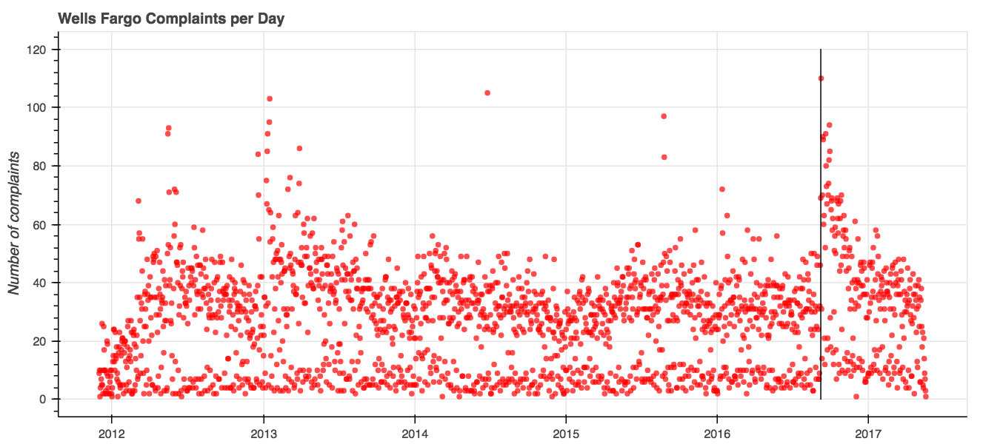
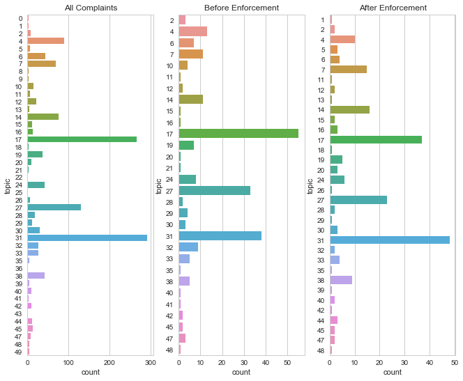

When consumer complaints come to the [Consumer Financial Protection Bureau](https://www.consumerfinance.gov/) (CFPB) complaints database, consumers get the chance to vent their spleen about [whatever happened to them](../cfpb-topic-modeling). As part of these complaint records, they also name the banks that caused the problems. With this information, we can see what happens when a big bank gets a big fine.   

And in September 2016, Wells Fargo got a big fine.   

You may remember this fine. The CFPB laid down the law with a [$100 million fine](https://www.consumerfinance.gov/about-us/newsroom/consumer-financial-protection-bureau-fines-wells-fargo-100-million-widespread-illegal-practice-secretly-opening-unauthorized-accounts/ "The total fine was even more, with an additional $85 million levied between another federal regulator and Los Angeles county government.") after consumers reported that Wells Fargo employees were opening up fake credit card accounts in their names in order to meet internal quotas. Consumers, when they heard about this became about twice as likely to complain each day.    

    

...for a while.   

In the four months prior to the fine, the CFPB registered **3,090 total complaints** about Wells Fargo. In the four months after the fine was levied, complaints jumped 58 percent to **4,896 complaints**. But by the end of the year, as the graph shows, the average complaint frequency dipped down to its prior levels.      

Beyond the sheer numbers of complaints registered against Wells Fargo, however, there isn't a major shift in topics of the complaints that consumers made to the CFPB.   

The graph below on the left demonstrates the distribution of [topics](../cfpb-topic-modeling) over the entire time the CFPB has been collecting those complaints. The other two graphs demonstrate the most frequent topics of complaints in the *four months prior* to the enforcement action being taken, and then their distribution in the *four months after* the enforcement action. As we covered earlier, four months was about the period of time in which the frequency of complaints had regressed to the same level as it was prior to enforcement.      

 
#### Wells Fargo complaint topics
   

The post-enforcement topics largely mirror the pre-enforcement topics - there isn't a large shift in conversation to entirely different topics. But three things are different:
1. The topic most frequently represented changed from topic 17 to topic 31.
2. There are 4 more topics after enforcement than there were prior to enforcement. New topics post-enforcement include: 5, 44, 13, 18, 26, 39, and 1. Topics that were not represented in comments after enforcement include: 10, 21, and 41.
3. Topics that saw increases after enforcement tended to be those that included words about contracts and agreements, which is consistent with more complaints about the types of financial company abuses that prompted the CFPB's enforcement action.

**Selected topics from Wells Fargo complaints**   

Topic No.|Words in topic | Count prior | Count after|   
:--:|:-----|:----:|:----:|   
31|*acct, pmi, remove, block, thru, bayview, dob, child, I've, dear* |37|47   
17|*boa, box, equip, internet, service, phh, return, install, west, cable* |55|38
27|*associ, recovery, new, portfolio, old, expire, type, unknown, york, service* |33|23
14|*party, third, agreement, term, page, consent, condition, disclose, site, exhibit* |11|16
5|*chase, charge, refund, discover, dispute, claim, cancel, merchant, transaction, purchase* |0|3
44|*contract, sign, son, signature, cancel, asset, manage, account, consult, never* |0|3

    
In some cases, the topics covered include words similar to those that would be common with other bank or credit-card transaction issues.   

One significant limitation to this analysis is that only about 10% of the Wells Fargo complaints have corresponding narrative descriptions, which is where the topics arise. Just looking at the total number that included a narrative, there were 238 complaints prior to enforcement, and 218 after. This may partially explain why there was limited change in the topics discussed after the enforcement action. While many more people claimed harm, approximately as many filled in the details of their stories.   

Taking a look at the way that the products that drove the complaints shows a huge shift for the "Bank account or service" product category, here in dark red, in the four months after enforcement. The lighter red indicates credit card complaints, which more than doubled over the same time period.   

   
