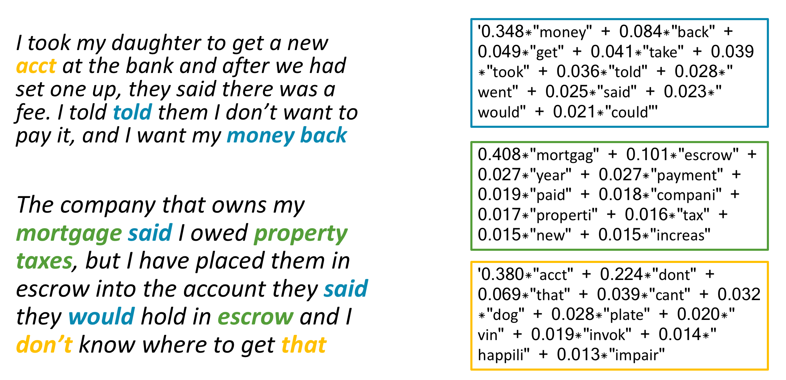

---

title: "Complaints to the CFPB"
author: "Brian Austin"
meta: "CFPB, civic engagement, complaints database"
---
The [Consumer Financial Protection Bureau](https://www.consumerfinance.gov/) (CFPB) collects consumer complaints against financial companies, as I've [discussed in this space](https://austinbrian.github.io/blog/cfpb-complaints-inauguration/). In trying to meet the problems identified in these complaints, whether by the CFPB or the company itself, it's important to understand what type of product is causing the problem. Teams work on products, and the issues across different types of financial products can vary significantly.

But the distinction between "My bank is opening up credit card applications I didn't ask for" and "my credit card company keeps calling my house, but I haven't missed a payment" is subtle, and the sort of thing that doesn't lend itself to easy product classifications.    

You can't just count the number of times the term "bank" is said, or "credit card" is said and get that this is about credit cards. The first is really about the bank's service, not the credit cards themselves. The second is really about a debt collector calling someone's home repeatedly.

To better understand what people are talking about in these complaints, I performed a modeling technique called Latent Dirichlet Allocation.

Here's a brief introduction to how it works.
1. The words in each complaint are converted to simplified versions of the words (i.e., both "property" and "properties" become "properti") and given unique identifier numbers.
2. Numbers that appear in the same complaint documents across the entire set of complaints are grouped together into "topics". These topics typically include words from multiple documents, and the words in a document are likely to be in multiple documents. Each word in a topic is given a weighting, indicating how "important" a word is to the topic - or how many times it is mentioned across documents in conjunction with the other words.   

In the example below, the chart below demonstrates how words in documents on the left match up with the topics across the entire document, on the right.   

   

The first topic is primarily about getting money back, and how consumers interact with the customer service gatekeepers who can do that. The second is all about making mortgage or other home payments (e.g., escrow, taxes). And the third is a little more opaque, with words that describe the account, and the way that interactions go. Not all topics are readily interpretable.

I tested out a series of the topic models to see what size might be a good descriptor, and landed on a topic size of 50.  
