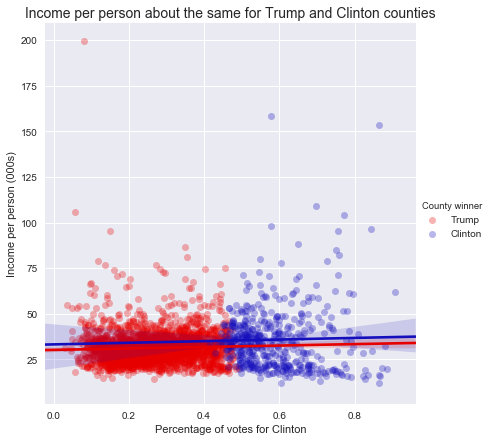

## Voting with their Tax Returns   
*An analysis of the relationship between deductions taken on income tax returns and county-level voting patterns in the 2016 election*    

In thinking about the 2016 election, I had a relatively simple question: did Hillary Clinton win among taxpayers?

I started with the logic that Clinton won about 3 million more popular votes in the general election than Donald Trump, and used tax returns as a window into the ways that the areas Trump won are different from the areas Clinton won.

One fun fact: according to a random forest analysis of the effect of all the possible deductions claimed, the most important factor in determining who would win the county was the total amount of student loan dollars claimed as deductions.

----

## Topic modeling with the CFPB database
*Natural language processing analysis of the topics discussed in complaints to the Consumer Financial Protection Bureau*
